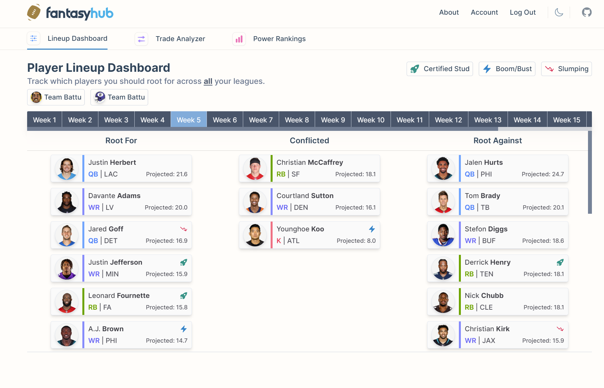

# fantasy-hub
A work-in-progress responsive SPA built using Vue 3, Tailwind CSS, and Google Cloud Functions. Users have ability to track their lineups across all of their fantasy football leagues, play with an accurate trade analyzer to discern the perfect packages, and maintain healthy competition through formulated power rankings.
### Lineup Dashboard

### Trade Analyzer

### Power Rankings
